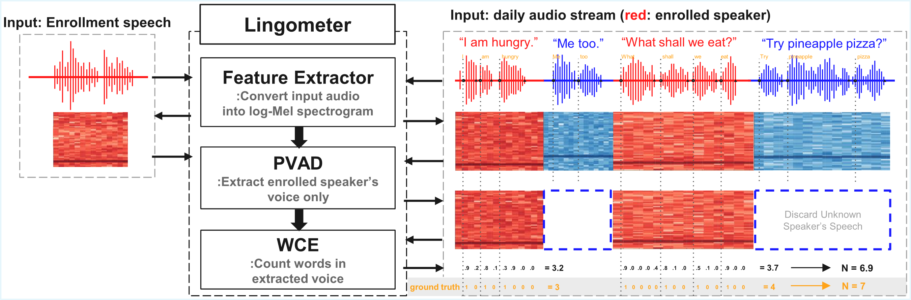

# LINGOMETER: ON-DEVICE PERSONAL SPEECH WORD COUNTING SYSTEM [ICASSP 2026]

[](https://www.python.org/downloads/) [](https://pytorch.org/) [](LICENSE)

> This repository contains the official implementation of the paper:
>
> **LINGOMETER: ON-DEVICE PERSONAL SPEECH WORD COUNTING SYSTEM** Accepted at the *IEEE International Conference on Acoustics, Speech and Signal Processing (ICASSP) 2026*
>
> **Authors:** Yuhwan Kim*, Junghun Lee*, Baekho Kim, and Hyun W. Ka
>
> *Equal contribution.

## Overview



> *ASR-free, on-device word count estimation from raw audio using PVAD and frame-level WCE.*

Lingometer is a privacy-preserving, fully on-device system that estimates a target speaker’s word count directly from raw audio, without speech transcription or ASR.

It combines Personalized Voice Activity Detection (PVAD) with a lightweight Word Count Estimation (WCE) model to enable frame-level word counting in natural multi-speaker conversations.

The Lingometer system follows a hierarchical pipeline as implemented in this repository:

1. Feature Extractor : Converts input audio into 24-dimensional log-Mel spectrograms.
2. PVAD (Upstream) : A Personalized Voice Activity Detection module (based on AS-PVAD) that identifies segments spoken by the enrolled user. We incorporate FiLM (Feature-wise Linear Modulation) for effective speaker conditioning.
3. WCE (Downstream) : A TCN-based Word Count Estimation model that predicts frame-level word onset probabilities and sums them for the final count.

## Key Features

* **Privacy-Aware Design**: Operates on-device, storing only the final word counts without recording raw speech or conversations from non-consenting speakers.
* **On-Device Efficiency**: A lightweight architecture (~1.53MB total size, ~0.40M parameters) optiized for long-term operation on portable and embedded devices.
* **Frame-Level Prediction**: Utilizes a WCE model that predicts word onsets at the frame level, achieving improved accuracy and robustness.

## Update Log

[v1.0.0] (Camera-ready Release) : Finalized code for Personal VAD, Word Count Estimator, and the complete pipeline.

## Prerequisites

Experiments were conducted in a Python 3.11 environment using `torch==2.5.1` and `torchaudio==2.5.1`. The system is expected to be compatible with Python 3.10–3.11.

* Python 3.10+
* PyTorch 2.5.1+
* Dependencies: Install all required packages using:

  ```
  pip install -r requirements.txt
  ```
* Datasets: This project utilizes the following datasets for training and evaluation:

  * [LibriSpeech](https://www.openslr.org/12): An ASR corpus based on public domain audio books , characterized by a "reading book" speech style.
  * [AMI Meeting Corpus](https://groups.inf.ed.ac.uk/ami/corpus/): A dataset consisting of multi-speaker interactions in naturalistic settings , representing a "meeting" speech style.
  * [CHiME-6](https://chimechallenge.github.io/chime6/): A collection of multi-speaker recordings captured in naturalistic environments , representing a "conversation" speech style.

## Citation

If you find this work useful for your research, please cite our paper:

```
@inproceedings{kim2026lingometer,
  title={Lingometer: On-Device Personal Speech Word Counting System},
  author={Kim, Yuhwan and Lee, Junghun and Kim, Baekho and Ka, Hyun W.},
  booktitle={Proc. IEEE International Conference on Acoustics, Speech and Signal Processing (ICASSP)},
  year={2026}
}
```

## Acknowledgment

This work was partially supported by National Research Foundation of Korea (Grants #RS-224-00406715, #RS-2022-NR068758, #NRF-2021S1A3A2A0108732)

## License

This project is licensed under the [Apache License 2.0](LICENSE).
